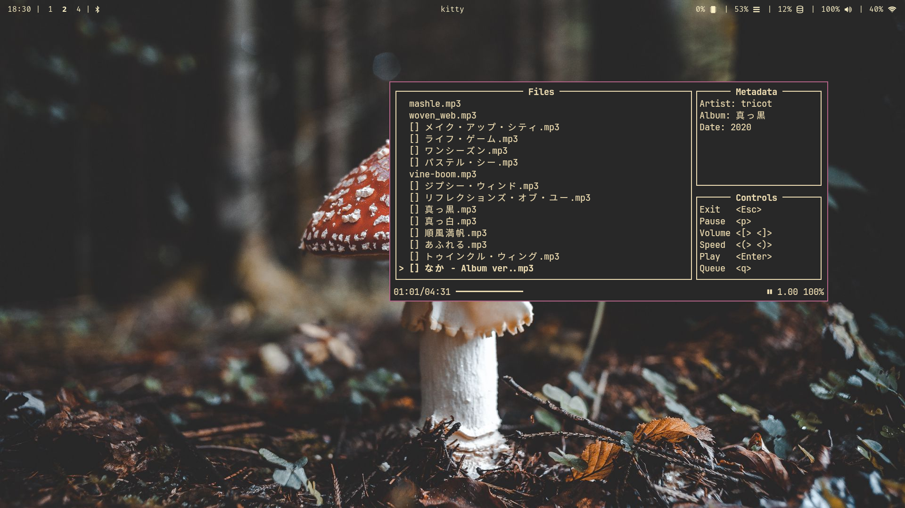

# A TUI music player!

# Usage
Call via `tuisic`. It reads from your XDG Music directory, so make sure you set that up. As of right now, it expects your music directory to be only 0 or 1 directories deep, like having it full of albums.

# Installing
Clone the repo and run `cargo build --release`, and move the build executable from the `target` directory to any place in your `PATH`. You can also use `cargo install __`.

# Todo
- Recursive Music Directory

